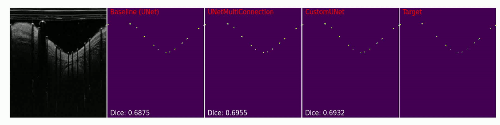

# Medical Segmentation with UNet-based Models
-------

UNet architecture was initially designed and introduced to solve medical image segmentation problems in 2015. The architecture shows superior performance compared to the previous traditional models for image segmentation and thus it was applied to many other fields of applications. The main reason why UNet excels at image segmentation is that the architecture is a fully-convolutional network consisting of a contracting path with max-pooling downsampling and an expanding path with upsampling blocks to regain pixel-level information. This way, UNet is able to capture more information with larger receptive field while preserving the image's localization information with residual connection during the expanding path.

    

